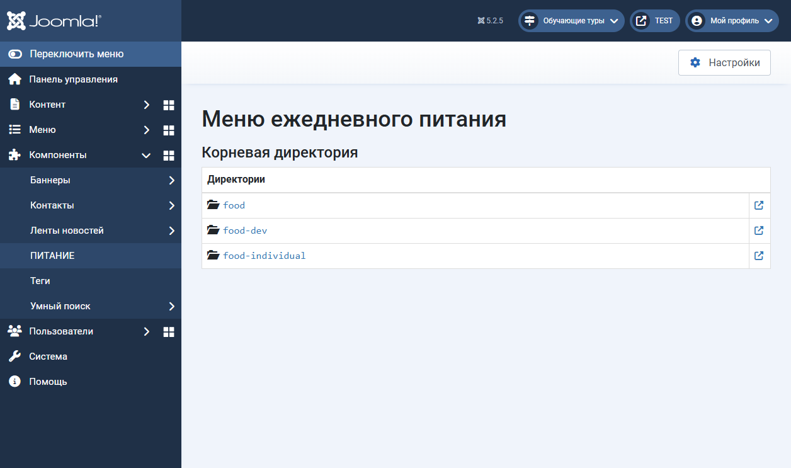
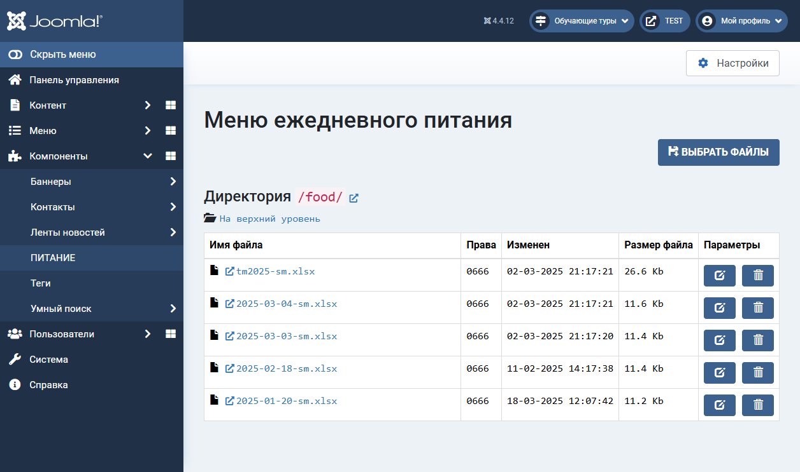

# Компонент «ПИТАНИЕ» Joomla CMS 4.x и 5.x

Компонент `com_food` для <ins>**Joomla CMS 4.x и 5.x**</ins>

Обслуживания директории `food` сайта школы. Актуально для школ РФ.

Предназначен для использования в административной панели Joomla CMS 4.x и 5.x.

Скачать [com_food-4.x-5.x.zip](com_food-4.x-5.x.zip?raw=true). Установить `Система` -> `Установка Расширения`

