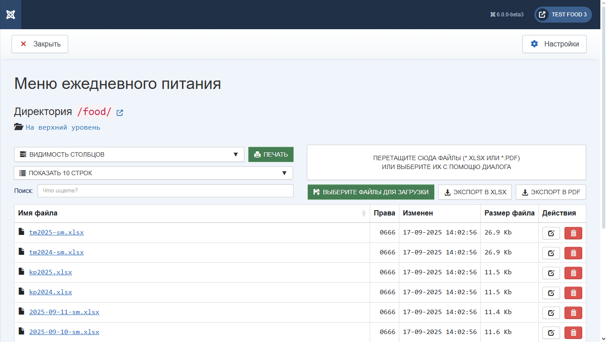

   

# Компонент «ПИТАНИЕ» Joomla CMS

Компонент **`com_food`** для Joomla CMS

Обслуживания директории **`food`** сайта школы. Актуально для сайтов школ РФ.

Предназначен для использования в административной панели Joomla.

После установки создаётся пункт меню `Компоненты` -> `Питание`

В настройках компонента есть возможность добавить дополнительные директории `food-*`. Основная директория `food` присутствует всегда вне зависимости от настроек.

Так же поддерживается обновление компонента средствами Joomla при выходе нового реализа

Сборка компонента происходит с помощью `npm` и `grunt` на стороне `GitHub` при публикации реализа.

## Установка

### Joomla CMS 3.x

Скачать компонент из реализа 

Установить через административную панель. `Расширения` -> `Расширения` -> `Установить`

### Joomla CMS 4.x

Скачать компонент из реализа 

Установить через административную панель. `Система` -> `Установка` -> `Расширения`

### Joomla CMS 5.x

Скачать компонент из реализа 

Установить через административную панель. `Система` -> `Установка` -> `Расширения`

### Joomla CMS 6.x

Скачать компонент из реализа 

Установить через административную панель. `Система` -> `Установка` -> `Расширения`

### Скриншот Joomla! 3.x

### Скриншот Joomla! 6.x

### Постскриптум

Если у вас возникли проблемы с компонентом или вы хотите **обновить вашу версию Joomla CMS**, то, по вашему желанию, вы можете обратиться ко мне для последующего обсуждения действий - [@ProjectSoft](https://t.me/ProjectSoft)
